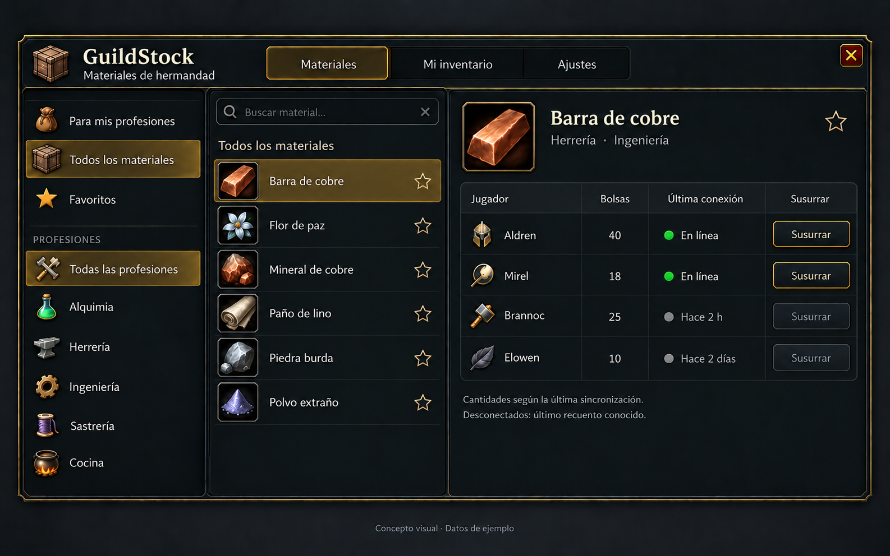
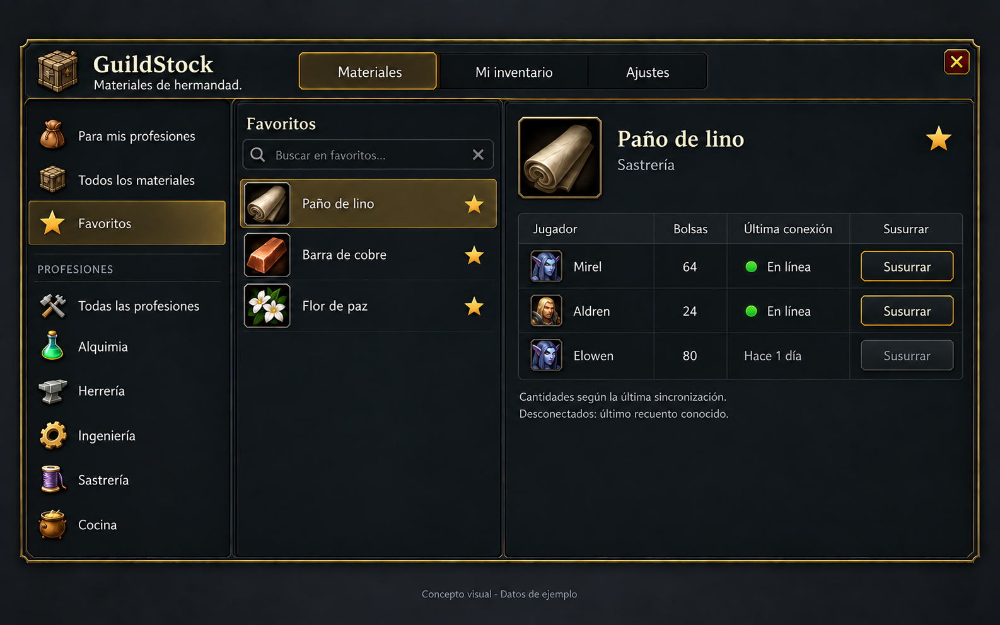
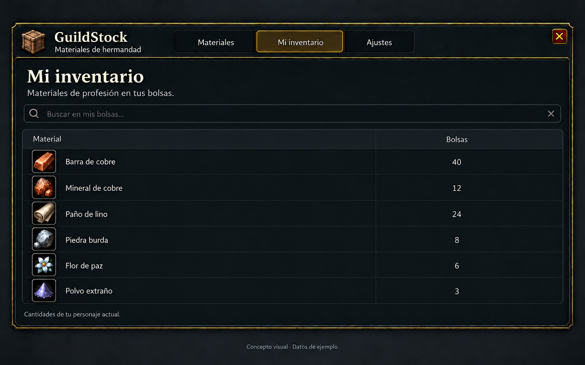
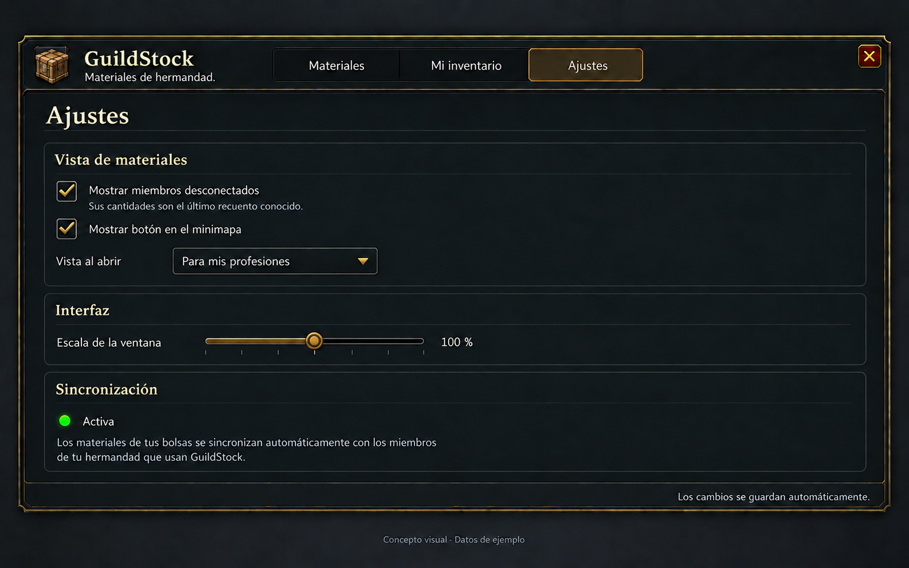
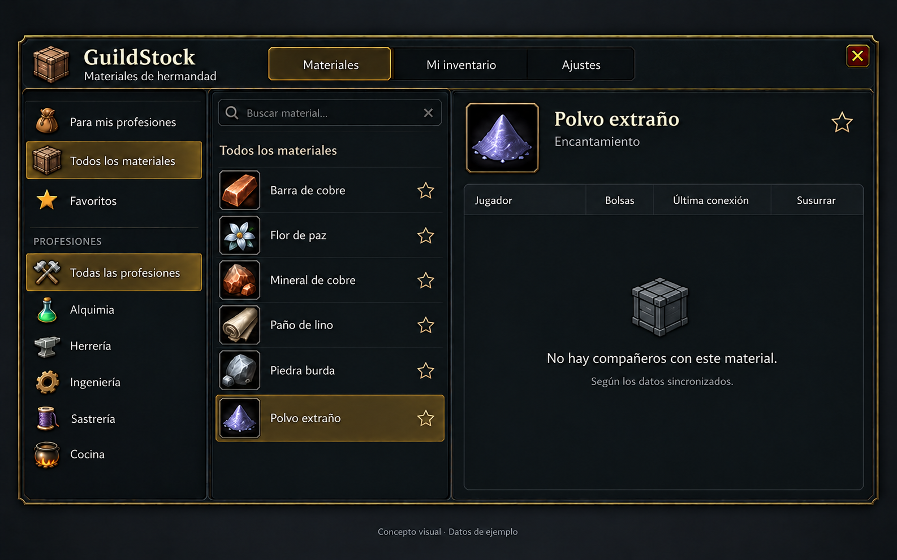

# Guild materials addon design and implementation plan

Design and implementation plan, October 3, 2026. Addon folder: **GuildStock**. The addon will help guild members find profession materials held by other participating characters. It will share inventory counts automatically; holding an item does not imply offering it for sale.

The user selected bags only, automatic synchronization between guild members, and a modern, clean interface with WoW styling. There are no material publications or manual publishing controls. Each character row has its own Whisper button, disabled while that character is offline. This document proposes the remaining behavior. The [0.2.1 interface prototype](README.md) includes the agreed four-tab layout, material browser, search, profession filters, favorites, a character inventory browser, local inventory and display settings. Its catalog contains only materials discovered from accessible client data, and distributed inventory remains unimplemented. A live check in build 70205 reported outgoing addon messages restricted in the development session; Settings displays that limitation. The technical diagnostics are available through a slash command. Feasibility still depends on proving addon communications in the matching Forever client environment and sourcing a complete matching-build material catalog.

## Player experience

One movable window, opened through a minimap button or slash command, with four tabs: Materials, Characters, My inventory, and Settings. English is the implementation's base language; Spanish belongs in locale tables. The concept images show the Spanish translation and fictional sample data.

- The left navigation offers All materials and Favorites. Its Professions section begins with All professions (Spanish: Todas las profesiones), followed by the individual profession icons. This is the only profession filter; there is no duplicate dropdown above the material list. Opening All materials selects All professions. Materials used by several professions appear under each relevant filter without duplicating inventory.
- Search matches localized material names across the complete Forever profession-material catalog, independently of guild stock. Clear a profession filter using All professions in the sidebar. Materials remain visible and searchable even when no participant reports stock.
- Selecting a material with no player rows leaves the table empty with its headings and one centered message: No players found with this material. (Spanish: No se han encontrado jugadores con este material.). Show no empty-state icon. This describes the available results, not proof that nobody in the guild owns the item. Keep technical synchronization restrictions in Settings. Do not fabricate zero-quantity character rows or hide the material from the catalog; if no material is selected, prompt the user to select one.
- The middle list shows material icons and names. Selecting one displays one row per character with positive known exchangeable stock. The exact columns are Player, Skills, Bags, Last online, and Whisper (Spanish: Jugador, Profesiones, Bolsas, Última conexión, Susurrar). Online rows come first; offline rows remain in the same table with muted styling and their last known bag counts.
- Skills shows exactly two icon slots for the character’s primary professions. Leave each missing slot as an empty bordered square; do not substitute a question mark or a secondary profession such as Cooking, Fishing or First Aid. Preserve an empty first slot when only the second is known. This adds no profession configuration or material view.
- The material detail header uses the same icon size and name typography as the material list. Keep it compact so the character table fills the remaining height. Its two informational footer notes share one line, aligned to the left and right edges.
- Last online shows Online for connected characters and the last known connection age for offline characters. Resolve that information from permitted guild-roster data and observed presence transitions; if unavailable, show Unknown rather than inventing a time. Last online is distinct from inventory observation age, which belongs in the quantity tooltip. Use zero only for a successful complete inventory observation; missing data never means zero.
- Every character row contains its own Whisper button. It opens WoW’s native chat addressed to that row’s character; the player writes and sends the message. It sends no addon payload and has no synchronization role. Disable the button for offline or unconfirmed connection states, explain why in a tooltip, and recheck connection state when clicked. There is no shared Whisper action beneath the table. There are no automatic orders, reservations, payments, or trades in the initial scope.
- No screen shows a synchronization label, indicator, or control in the footer. Automatic synchronization continues in the background; its informational status belongs only inside Settings.
- Characters follows Materials. The left pane lists all current-guild characters with complete known inventory data, sorted by full name, with its own search and scroll bar. Selecting a character shows their item icons, localized names and bag quantities on the right, with item search and the observation time. Include a character with a confirmed empty inventory; do not substitute a roster-only member or an incomplete read. Clear details when the selected record disappears or the guild scope changes. This view does not publish inventory or initiate transport.
- My inventory is a read-only view of profession materials in the player’s bags. Synchronization runs automatically while the addon is enabled and the character belongs to the guild, subject to client restrictions. There are no publish, offer, pause-publication, or manual synchronization buttons.
- Settings use the full content width beneath the top tabs, without the material/profession sidebar. They are limited to showing offline members, minimap-button visibility, the initial view, and window scale. Show synchronization as a read-only status and save settings automatically. These presentation choices do not switch inventory synchronization on or off.

Favorites are manual. The user removed For my professions to keep configuration simple; both navigation and the opening-view setting offer only All materials and Favorites. Recipe-specific shortages require a selected recipe and target quantity and can follow later.

## Concept images

These images explore appearance and layout, not tested game functionality. Material names, quantities, timing, and characters are illustrative; their presence does not certify Forever catalog coverage. Use the player's guild emblem or a neutral materials icon in production, rather than a fixed faction crest.

Created with the built-in image generation tool. The [prompt set](mockups/prompts.json) covers the screens and the empty-owner state. These images predate the removal of For my professions: omit that navigation entry and setting when implementing them. The [removed profession view](mockups/my-professions.png) and earlier generation prompts remain as design history.

The earlier [material browser](../docs/guild-materials/material-browser.png), [own inventory](../docs/guild-materials/my-inventory.png), and [original prompts](../docs/guild-materials/prompts.json) are superseded historical drafts. Their bank columns, shared Whisper action, and publication controls are not part of the current design. The new All materials screen defines the revised row layout for both material views.

## Scope and inventory meaning

The catalog must contain every profession material available in the supported Forever build, including materials held by nobody in the guild. Catalog membership never depends on the contents of synchronized inventories. It needs item IDs, material categories, and a many-to-many relationship to consuming professions. Names and icons should come from client item data, with asynchronous loading and an item-ID placeholder while loading.

Reading inventories or the local character's recipes alone does not establish catalog completeness. First identify a usable matching-build dataset and its redistribution terms, then audit against the client's professions and recipes. Record source revision and coverage. A prototype may use a clearly labeled subset; a release must not advertise all materials until coverage has been verified. Do not import a Retail or Classic material list without checking every included mapping against Forever.

The confirmed inventory scope is profession materials in the current character's bags only. Proposed exchangeable-only filtering keeps bound materials out of guild availability, while allowing the local view to explain excluded items. All bank storage, mail, auction listings, equipped items, and consolidated alternate characters are outside this first scope. No bank scan, bank event handling, bank count field, or bank setting is needed.

Only clients running a compatible addon can report inventory. The addon reads its own character's inventory and receives self-reported counts from peers; it cannot inspect a guild member's bags remotely. A missing participant means no data, not zero materials.

## Synchronization proposal

Use the native addon-message transport: register a dedicated short prefix with `C_ChatInfo.RegisterAddonMessagePrefix`, send using `C_ChatInfo.SendAddonMessage`, and receive `CHAT_MSG_ADDON`. All synchronization uses GUILD exclusively: discovery, inventory changes, snapshot requests, initial snapshots, repairs and acknowledgements. A request aimed at one participant includes a verified logical recipient and request ID in its payload; every participant can receive the guild packet, and only the intended participant responds. Do not use addon WHISPER. These are addon payloads, not ordinary guild chat lines or a custom channel players must join. They should be invisible in normal chat, but are not encrypted or private from other guild addons listening to the prefix.

The exact build exposes addon-message restrictions and explicit sending result enums. Phase 0 must verify GUILD requests, GUILD acknowledgements and actual receipt, including across shards. Players choose rulesets rather than traditional realms; send to the guild without layer routing or an invented realm suffix; preserve full names for membership checks and native chat recipients. If transport is restricted, display the limitation and retain the local inventory view; do not fall back to chat spam or attempt a bypass. See the shared [Forever identity and communication reference](../docs/BLIZZARD_API.md#forever-rulesets-layers-and-addon-communications).

Proposed timing, subject to user preference and measurements:

| Trigger | Local action | Network action |
| --- | --- | --- |
| Login or UI reload | Restore validated saved data, wait for inventory and guild readiness, scan bags | Announce protocol/session/revision after a random 2–8 second delay; ask online peers for their own snapshots if needed |
| Bag changes | Coalesce `BAG_UPDATE_DELAYED` bursts and rescan affected readable containers | Send final absolute counts for changed item IDs, at most one change batch every 10–15 seconds; continuous activity must not postpone forever |
| Every five minutes | Check current state | Send a small presence/session/revision heartbeat with random timing; request a snapshot only on mismatch |
| Window opening | Render cache immediately | Automatically request stale or missing records, subject to a 30 second request cooldown |
| Confirmed guild roster change | Delete departed members from the local guild database, including their cached inventory and presence records | Cancel their pending requests/transfers and reject subsequent packets unless membership is verified again |
| Leaving or changing guild | Stop old-guild synchronization and delete the old guild’s peer records | Cancel queued old-guild packets; begin discovery only when new membership is established |

These are proposed product timings, not Blizzard rate limits. Queue packets under a conservative measured byte budget, handle throttle/lockdown results with bounded retry, and stagger responses when several people log in together. Do not broadcast full inventories every five minutes or send every search keystroke to the guild.

Treat heartbeat presence, guild online status, and data freshness as separate facts. Proposed policy: after two missed five-minute heartbeats, mark addon participation unconfirmed, even if the roster says online. Retain historical observations of current guild members for seven days, visibly dated and excluded from current-stock totals. Delete confirmed former members immediately from the local guild database, rather than merely hiding their rows or waiting for history expiry. A new client cannot recover an offline character's history it never received: the first version has no server and peers report only their own inventory.

## Data and protocol

Keep one independent addon folder and SavedVariables namespace. A minimal initial layout is the manifest, locale table, catalog table, core inventory/communication logic, UI, and a small Lua test file. Split further only when an actual implementation needs it. Reuse the repository's minimap and locale conventions without extracting a shared dependency.

Reconcile saved peer records against a complete, authoritative current guild roster after login and whenever membership changes. Remove confirmed departed members from saved and in-memory inventory, presence, session/revision state, indexes, and pending transfers. Late packets must not recreate them. An offline player is still a member; a missing heartbeat or an unavailable, partial, or temporarily empty roster is not evidence of departure. Wait for verified membership data before pruning and before accepting unknown senders. The precise roster completeness signal must be verified during the API feasibility test. On confirmed guild departure/change by the local character, purge the old guild’s peer cache while preserving the catalog, own bag snapshot, favorites, and UI preferences.

Store schema version, user preferences, own validated snapshots, and guild-scoped peer observations. Character records also carry two optional primary-profession keys reported by that character through GUILD. Keep unreadable profession data distinct from a confirmed unlearned slot; never infer a player’s professions from their materials. This metadata still awaits synchronization implementation. Each inventory observation has material item ID, bag count, and observation timestamp. Store guild presence and last known connection time separately; neither receiving a packet nor reading a cached inventory establishes a precise last logout time. Resolve guild identity from the initialized club API and preserve full regional character identities and verified transport addresses. A shard transfer must neither rekey characters nor purge guild records. Do not publish local diagnostics containing real player lists or identifiers.

Use a small versioned protocol with four logical message types: presence, snapshot request, snapshot, and changes. Include session ID and revision, with base revision for changes. Changes carry absolute counts, including explicit zero/removal records; never sum repeated deltas. Assign ownership from the event sender and verified current guild membership, not an owner name supplied in the payload. Requested GUILD responses must match an outstanding request and its verified guild sender; other participants ignore replies to unrelated requests.

Split larger snapshots into bounded packets with revision, sequence, and total-part fields. Stage them until complete, then replace the prior snapshot atomically. Discard timed-out incomplete transfers while preserving the last complete observation. Ignore duplicate/older revisions within a session; a new session starts with a requested full snapshot, and packets from superseded sessions cannot restore old stock. Missing change revisions trigger one rate-limited repair request.

Validate protocol version, allowed channel, sender, guild scope, item IDs, finite nonnegative integer quantities, packet lengths/counts, and timestamp bounds. Limit pending reassembly memory and requests per sender. Never execute received Lua. A guild member can still lie about their own counts; this protocol is a convenience directory, not proof of ownership.

On initialization, validate saved tables without overwriting valid data. Preserve unknown newer schemas rather than resetting them. Missing/inaccessible inventory is distinct from an observed empty inventory. Incoming network data must never replace the local character's authoritative inventory. The known Forever SavedVariables issue remains open and requires reload/restart testing; do not add a private recovery dependency or claim persistence is fixed by the new build.

## Implementation stages and completion checks

1. **Prove the APIs in build 70205.** Record `GetBuildInfo()`, restriction state, prefix result, sending results, and actual round-trip receipt for two guild clients. Verify surname/addressing, roster membership and completeness, connection status, and availability of last-online information. Verify bound-item visibility and profession enumeration. Completion: documented two-client communication plus correct bag sample counts; if transport fails, stop the network implementation and revisit feasibility.
2. **Establish the catalog and local inventory.** Source and audit the full build-specific material set and profession relationships. Implement complete bag snapshots, asynchronous item names, and persistence validation. Completion: all verified Forever profession materials are in the catalog, including those with no synchronized owners; a material held by nobody remains searchable; looting, trading, crafting, selling, moving items out of bags, and reaching zero give correct counts; an incomplete bag scan preserves the last valid observation. Keep a small runnable Lua check for these state transitions.
3. **Implement synchronization.** Build registration, discovery, bounded packet queue, full snapshot/absolute changes, revision repair, presence, and guild isolation. Completion: two clients converge after changes and reconnects. Offline tests cover duplicate/reordered/missing packets, explicit zero, incomplete snapshots, bad input, guild changes, and throttle/lockdown behavior. Check that a confirmed departure deletes saved records, survives reload, and cannot be undone by a late packet; an offline member or incomplete roster must not trigger deletion. These tests do not replace real delivery tests.
4. **Build the agreed interface.** Add the material browser, search, profession filter, favorites, player rows, own inventory, and compact settings. Use native frames and item icons with modern restrained styling. Completion: All professions is the first sidebar profession option, no duplicate dropdown or synchronization footer remains, and empty owner tables show the explanatory notice without removing catalog entries; long localized names, empty search results, missing bag data, offline history, and large lists remain readable; every row has its own Whisper action, disabled immediately when its character goes offline; keyboard focus, Escape, dragging, scrolling, and UI scale work in-game. Whisper only prepares a draft.
5. **Pilot and release.** Test with several consenting guild participants, then a larger group for traffic and responsiveness. Check simultaneous logins, disconnects, absent addon users, mixed protocol versions, combat, and no-guild state. Run Lua syntax and repository regression checks, verify reload/full restart persistence, and record build-specific results in the API log. Publish reviewed files to GitHub. Prepare a CurseForge release only when requested, using the repository publishing skill.

## Decisions still open

Confirmed: bags only, GUILD as the sole addon transport, automatic guild synchronization without publications or a footer indicator, the complete Forever profession-material catalog with an empty-owner notice, deletion of departed guild members from the local database, All materials and Favorites as the only material views, All professions as the first sidebar profession filter without a duplicate dropdown, and a Whisper button on every character row, disabled when offline. Offline character rows and Last online are part of the requested design. Final visual adjustments, timing policy, historical retention period, and exchangeable-only filtering remain open. Seven-day retention is a proposal, not a confirmed requirement.

Bank support, pricing, purchase orders, reservations, automatic transactions, and exact recipe shortage calculations can be added when the guild has a concrete need. They are not required to answer the first useful question: who has this material, how much was observed, and how old is that information?
