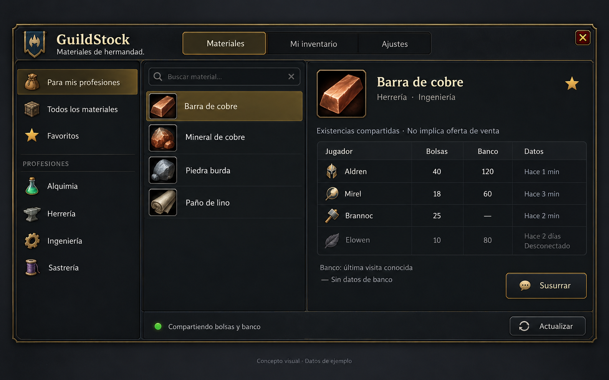
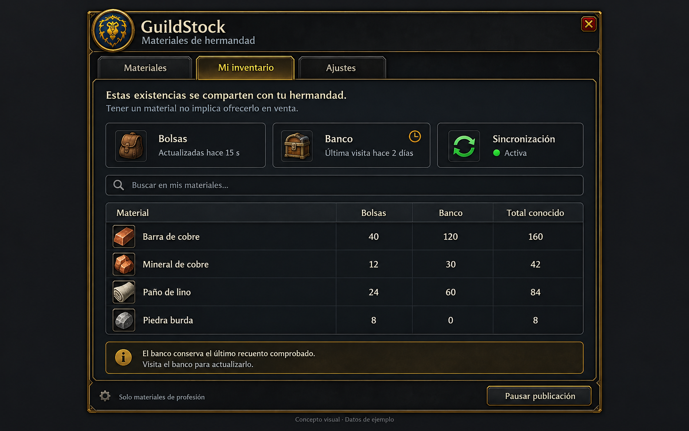

# Guild materials addon design and implementation plan

Draft for discussion, October 3, 2026. Working name: **GuildStock**, not yet selected as the final addon name. The addon will help guild members find profession materials held by other participating characters. It will share inventory counts automatically; holding an item does not imply offering it for sale.

The user selected automatic bag and bank sharing and a modern, clean interface with WoW styling. This document proposes the remaining behavior. No addon code has been implemented. Feasibility depends first on proving addon communications on the actual Forever realm and sourcing a complete matching-build material catalog.

## Player experience

One movable window, opened through a minimap button or slash command, with three tabs: Materials, My inventory, and Settings. English is the implementation's base language; Spanish belongs in locale tables. The concept images show the Spanish translation and fictional sample data.

- The left navigation offers For my professions, All materials, Favorites, and profession filters. Materials used by several professions appear under each relevant filter without duplicating inventory.
- Search matches localized material names across the catalog. An active profession filter remains visible and easy to clear. A material stays searchable even when no participant reports stock.
- The middle list shows material icons and names. Selecting one displays one row per character with positive known exchangeable stock: character, bags, bank, connection state, and observation ages. Sorting favors reachable participants with recent bag data; historical records are separate.
- Bank age and bag age are independent. Use an em dash for unknown counts and zero only for a successful complete observation. A recent heartbeat never makes an old bank observation appear fresh.
- A Whisper action opens a draft addressed to the selected character, with the material link. The player sends it. There are no automatic orders, reservations, payments, or trades in the initial scope.
- My inventory explains exactly what is shared, distinguishes bags from the last bank visit, and offers a pause control. Pausing announces withdrawal when permitted and removes active listings on receiving clients; it cannot erase data already copied by others.

For my professions means materials used by the player's learned professions. It is a relevance filter, not a claim that the player is missing those materials. Favorites are manual. Recipe-specific shortages require a selected recipe and target quantity and can follow later.

## Concept images

These images explore appearance and layout, not tested game functionality. Material names, quantities, timing, and characters are illustrative; their presence does not certify Forever catalog coverage. Use the player's guild emblem or a neutral materials icon in production, rather than a fixed faction crest.

Created with the built-in image generation tool. The [final prompt set](guild-materials/prompts.json) is retained with the concepts.

Production refinements beyond the concept art: give offline records their own section and show separate bag and bank timestamps in row details/tooltips. Never present cached bank quantities as immediately accessible bag stock. Settings should stay small: sharing status, bank inclusion, and historical-record visibility.

## Scope and inventory meaning

The catalog target is every profession material available in the supported Forever build, including materials held by nobody in the guild. It needs item IDs, material categories, and a many-to-many relationship to consuming professions. Names and icons should come from client item data, with asynchronous loading and an item-ID placeholder while loading.

Reading inventories or the local character's recipes alone does not establish catalog completeness. First identify a usable matching-build dataset and its redistribution terms, then audit against the client's professions and recipes. Record source revision and coverage. A prototype may use a clearly labeled subset; a release must not advertise all materials until coverage has been verified. Do not import a Retail or Classic material list without checking every included mapping against Forever.

Proposed initial sharing scope is exchangeable profession materials in the current character's bags and personal bank. Keep bound materials out of guild availability, while allowing the local view to explain excluded items. Bank of account, guild bank, mail, auction listings, equipped items, and consolidated alternate characters are outside this first scope. Account-bank stock must eventually have shared ownership semantics to avoid counting it once per character.

Only clients running a compatible addon can report inventory. The addon reads its own character's inventory and receives self-reported counts from peers; it cannot inspect a guild member's bags remotely. A missing participant means no data, not zero materials.

## Synchronization proposal

Use the native addon-message transport: register a dedicated short prefix with `C_ChatInfo.RegisterAddonMessagePrefix`, send using `C_ChatInfo.SendAddonMessage`, and receive `CHAT_MSG_ADDON`. Proposed channels are GUILD for discovery and inventory changes, and WHISPER for requested initial snapshots or repairs. These are addon payloads, not ordinary guild chat lines or a custom channel players must join. They should be invisible in normal chat, but are not encrypted or private from other guild addons listening to the prefix.

The exact build exposes realm restrictions and explicit sending result enums. Phase 0 must verify both channels and actual receipt. If transport is restricted, display the limitation and retain the local inventory view; do not fall back to chat spam or attempt a bypass. See the [build evidence and pending tests](BLIZZARD_API.md#guild-materials-feasibility-review-october-3-2026).

Proposed timing, subject to user preference and measurements:

| Trigger | Local action | Network action |
| --- | --- | --- |
| Login or UI reload | Restore validated saved data, wait for inventory and guild readiness, scan bags | Announce protocol/session/revision after a random 2–8 second delay; ask online peers for their own snapshots if needed |
| Bag changes | Coalesce `BAG_UPDATE_DELAYED` bursts and rescan affected readable containers | Send final absolute counts for changed item IDs, at most one change batch every 10–15 seconds; continuous activity must not postpone forever |
| Bank visit and changes while open | Read purchased character-bank tabs from the API, scan accessible complete contents | Send verified changes with a new bank observation time; retain old data if the scan is incomplete |
| Bank closing | Preserve the last complete snapshot | Flush already observed changes; do not depend on reading slots after closure |
| Every five minutes | Check current state | Send a small presence/session/revision heartbeat with random timing; request a snapshot only on mismatch |
| Window opening or Refresh | Render cache immediately | Request stale or missing records, subject to a 30 second request cooldown |
| Leaving or changing guild | Stop old-guild publication and hide old-guild records | Cancel queued old-guild packets; begin discovery only when new membership is established |

These are proposed product timings, not Blizzard rate limits. Queue packets under a conservative measured byte budget, handle throttle/lockdown results with bounded retry, and stagger responses when several people log in together. Do not broadcast full inventories every five minutes or send every search keystroke to the guild.

Treat heartbeat presence, guild online status, and data freshness as separate facts. Proposed policy: after two missed five-minute heartbeats, mark addon participation unconfirmed, even if the roster says online. Retain historical observations for seven days, visibly dated and excluded from current-stock totals. Hide confirmed former members immediately. A new client cannot recover an offline character's history it never received: the first version has no server and peers report only their own inventory.

## Data and protocol

Keep one independent addon folder and SavedVariables namespace. A minimal initial layout is the manifest, locale table, catalog table, core inventory/communication logic, UI, and a small Lua test file. Split further only when an actual implementation needs it. Reuse the repository's minimap and locale conventions without extracting a shared dependency.

Store schema version, user preferences, own validated snapshots, and guild-scoped peer observations. Each observation has material item ID, separate bag and bank counts, and separate observation timestamps. Resolve the guild identity and character addressing using verified Forever APIs; do not assume surname equals realm. Do not publish local diagnostics containing real player lists or identifiers.

Use a small versioned protocol with four logical message types: presence, snapshot request, snapshot, and changes. Include session ID and revision, with base revision for changes. Changes carry absolute counts, including explicit zero/removal records; never sum repeated deltas. Assign ownership from the event sender and verified current guild membership, not an owner name supplied in the payload. WHISPER responses must match an outstanding request to a verified guild member.

Split larger snapshots into bounded packets with revision, sequence, and total-part fields. Stage them until complete, then replace the prior snapshot atomically. Discard timed-out incomplete transfers while preserving the last complete observation. Ignore duplicate/older revisions within a session; a new session starts with a requested full snapshot, and packets from superseded sessions cannot restore old stock. Missing change revisions trigger one rate-limited repair request.

Validate protocol version, allowed channel, sender, guild scope, item IDs, finite nonnegative integer quantities, packet lengths/counts, and timestamp bounds. Limit pending reassembly memory and requests per sender. Never execute received Lua. A guild member can still lie about their own counts; this protocol is a convenience directory, not proof of ownership.

On initialization, validate saved tables without overwriting valid data. Preserve unknown newer schemas rather than resetting them. Missing/inaccessible inventory is distinct from an observed empty inventory. Incoming network data must never replace the local character's authoritative inventory. The known Forever SavedVariables issue remains open and requires reload/restart testing; do not add a private recovery dependency or claim persistence is fixed by the new build.

## Implementation stages and completion checks

1. **Prove the APIs in build 70205.** Record `GetBuildInfo()`, restriction state, prefix result, sending results, and actual round-trip receipt for two guild clients. Verify surname/addressing and roster membership. Visit the personal bank and identify its real container IDs. Verify bound-item visibility and profession enumeration. Completion: documented two-client communication plus correct bag/bank sample counts; if transport fails, stop the network implementation and revisit feasibility.
2. **Establish the catalog and local inventory.** Source and audit the full build-specific material set and profession relationships. Implement complete bag/bank snapshots, asynchronous item names, and persistence validation. Completion: a material held by nobody remains searchable; depositing, withdrawing, crafting, selling, and reaching zero give correct counts; an inaccessible bank preserves its last complete record. Keep a small runnable Lua check for these state transitions.
3. **Implement synchronization.** Build registration, discovery, bounded packet queue, full snapshot/absolute changes, revision repair, presence, withdrawal, and guild isolation. Completion: two clients converge after changes and reconnects. Offline tests cover duplicate/reordered/missing packets, explicit zero, incomplete snapshots, bad input, guild changes, and throttle/lockdown behavior. These tests do not replace real delivery tests.
4. **Build the agreed interface.** Add the material browser, search, profession filter, favorites, player rows, own inventory, and compact settings. Use native frames and item icons with modern restrained styling. Completion: long localized names, empty results, unknown bank data, offline history, and large lists remain readable; keyboard focus, Escape, dragging, scrolling, and UI scale work in-game. Whisper only prepares a draft.
5. **Pilot and release.** Test with several consenting guild participants, then a larger group for traffic and responsiveness. Check simultaneous logins, disconnects, absent addon users, mixed protocol versions, combat, and no-guild state. Run Lua syntax and repository regression checks, verify reload/full restart persistence, and record build-specific results in the API log. Publish reviewed files to GitHub. Prepare a CurseForge release only when requested, using the repository publishing skill.

## Decisions still open

The working name, final visual adjustments, timing policy, and offline-history policy remain open until the user selects them. Bank sharing and automatic inventory publication are confirmed requirements, conditional on technical access. The proposed exchangeable-only scope, personal-bank-only first release, seven-day history, and profession relevance rules can be refined before implementation.

Pricing, purchase orders, reservations, automatic transactions, account-bank aggregation, and exact recipe shortage calculations can be added when the guild has a concrete need. They are not required to answer the first useful question: who has this material, how much was observed, and how old is that information?
